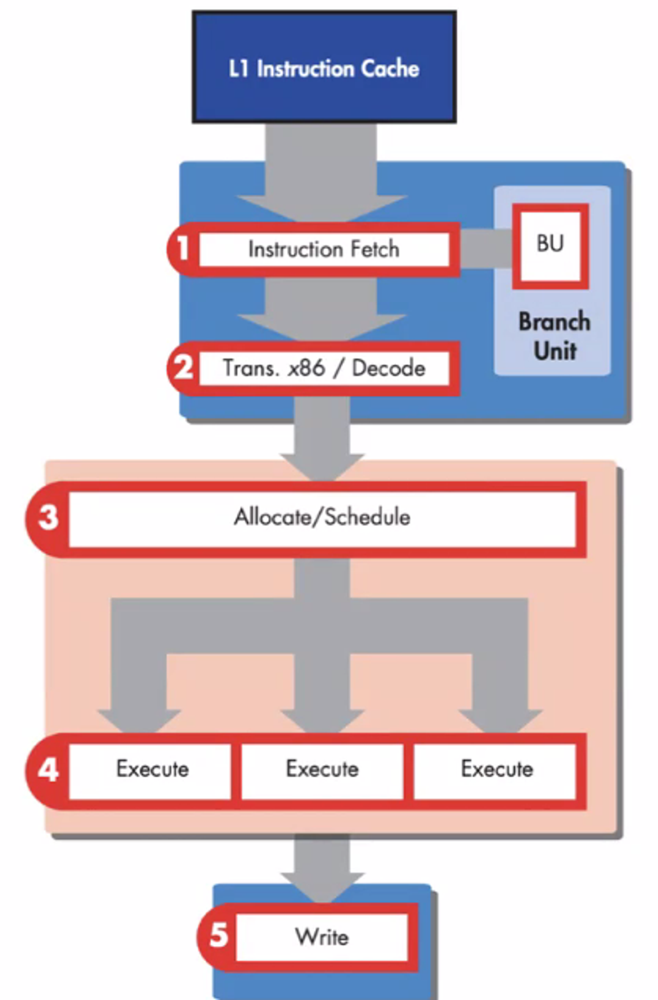
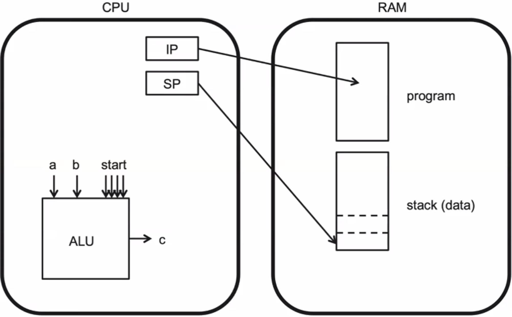
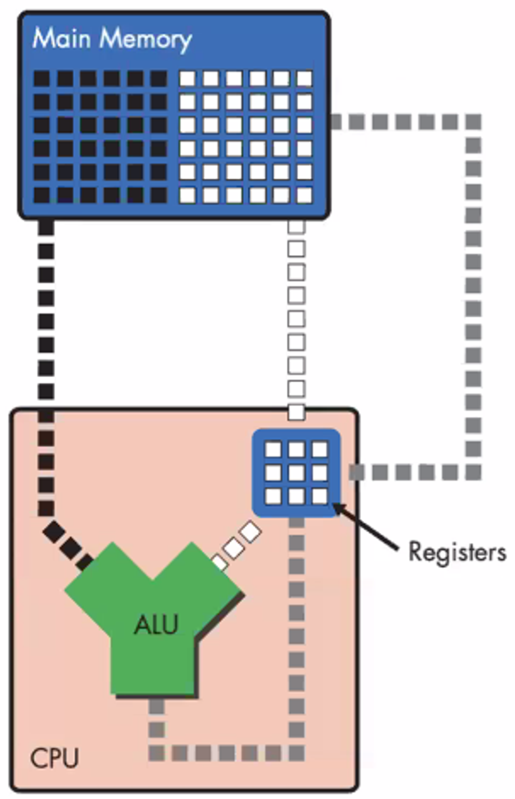

# isa_python_implementation
As part as the [Computer Science Bootcamp]((https://codigofacilito.com/bootcamps/ciencias-computacionales/dashboard)) 
from [Codigo Facilito](https://codigofacilito.com/)
, in the class **Machines**, we learned how a computer internally process
the information and instructions.

The purpose of this repository is to create simulation that represents
the main functionality and **ISA** of a simple computer.



## Architecture
Taking as inspiration the **Von Newman** architecture has the following main components: 


- **ALU:** Arithmetic Logic Unit
- **CPU:** Central Process Unit 
- **RAM:** Random Access Memory
- **IP:** Instruction Pointer - Small register(number) in the CPU, 
it points the instruction of the program in the RAM.
- **SP:** Stack Pointer - Indicates where data is going to be stored

The CPU retrieves small chunks of instructions from the RAM memory 
that have been previously loaded from the hard drive.

These instructions are read from the memory by the **IP**,
loaded, and executed by the **ALU**

After the **ALU** executes the corresponding arithmetic and 
logic operations the results can be stored back to the memory.

In order to store or retrieve data from the memory, the **SP**
can point where the data needs to be retrieved from or stored to.

The **ISA**(Instruction Set Architecture) is a set of instructions 
that define what kind of operations can be performed on the hardware.

## Registers
Registers are tiny spaces of memory that can be used to read and write values
that usually represent addresses in the memory. 

The size of a register determines how big the data can be stored
and how many memory registers can access


## Code Example
As previously stated, the purpose of this repository is to simulate
the basic instructions of a CPU:

These instructions are the following:
```python
"""
Recreate the basic operations of a CPU, instructions occur as follows:
(<operation>, [comparison], <registry a>, <registry b>, <registry c>)

# Add two registries and store into another registry
('ADD', 'Ra', 'Rb', 'Rc')
# Subtract Rb from Ra and store into another registry
('SUB', 'Ra', 'Rb', 'Rc')
# Multiply two registries and store into another registry
('MUL', 'Ra', 'Rb', 'Rc')
# Divide two registries and store into another registry
('DIV', 'Ra', 'Rb', 'Rc')
# Add one to the registry and store into the SAME registry
('INC', 'Ra')
# Subtract one to the registry and store into the SAME registry
('DEC', 'Ra')
# Compare two registries according to the desired operation
('CMP', 'op', 'Ra', 'Rb', 'Rc') # op = {<,>,<=, >=, ==, !=}
# Load from RAM memory
('LOAD', 'Rs', 'Rd', offset) # offset -> direction where to store data
# Save to RAM memory
('STORE', 'Rs', 'Rd', offset) # offset -> direction where to store data
# Jump from one registry to another
('JMP', Rd, offset)
# End the program
('HALT')

"""
```
Implementation must be from a CPU class as abstraction and must have a method for every operation stated.
Must have a structure for representing the registers of the CPU and a way to access the memory.

Finally, must be able to store and retrieve data from the memory.
